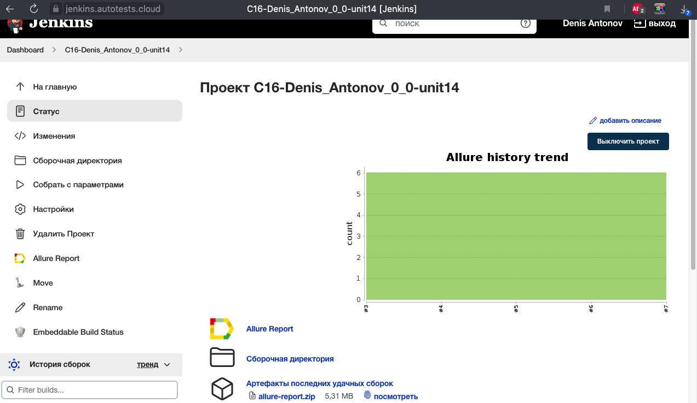
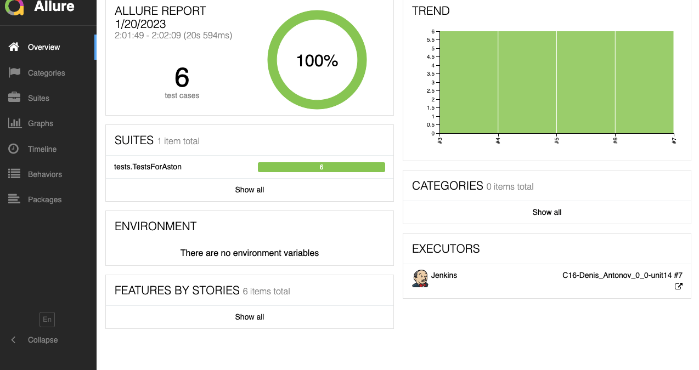
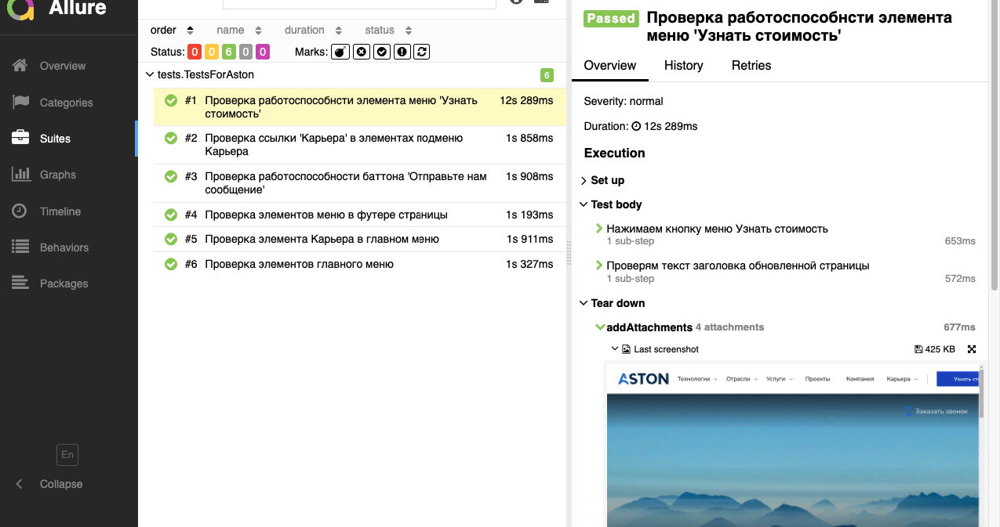
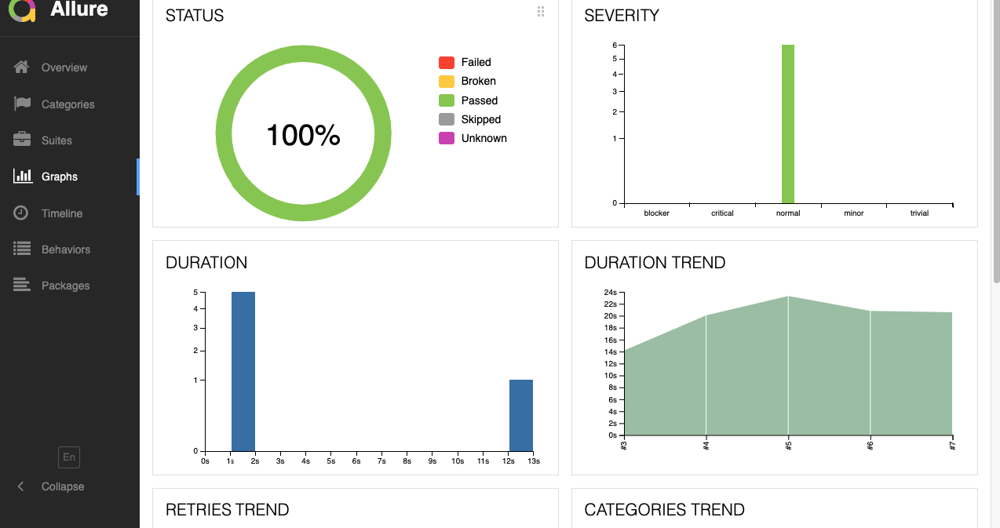
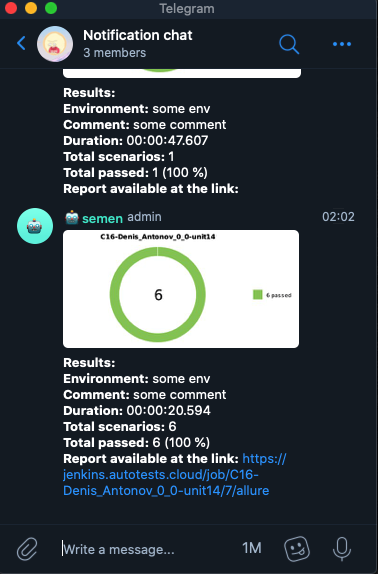
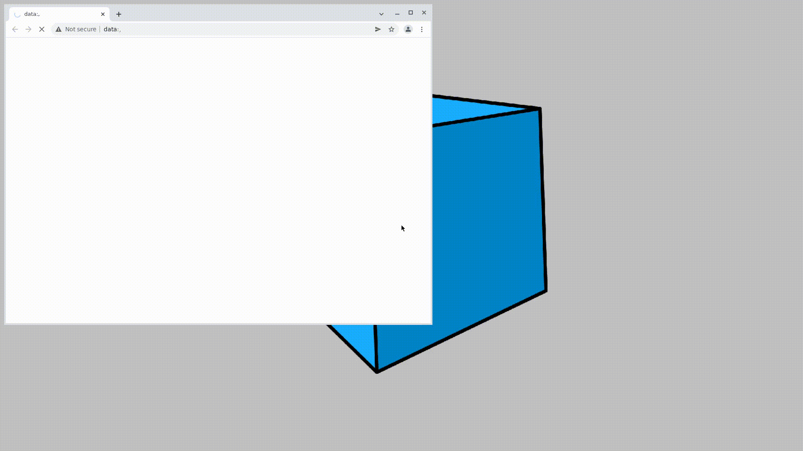

# Проект по автоматизации тестирования для Aston
<a target="_blank" href="https://astondevs.com/">Веб-сайт Aston</a>

## :scroll: Содержание:

* <a href="#stack">Используемые технологии</a>
* <a href="#verifications">Реализованные проверки</a>
* <a href="#jenkins-build">Параметры сборки в Jenkins</a>
* <a href="#terminal-run">Запуск тестов из терминала</a>
* <a href="#allure-report">Allure отчет</a>
* <a href="#telegram-notification">Отчет в Telegram</a>
* <a href="#selenoid-video">Видео примеры прохождения тестов</a>

<a id="stack"></a>
## 🔧 Используемые технологии:

<p align="center">
<a href="https://www.jetbrains.com/idea/"></a>
<a href="https://www.java.com/"></a>
<a href="https://github.com/"></a>
<a href="https://junit.org/junit5/"></a>
<a href="https://gradle.org/"></a>
<a href="https://selenide.org/"></a>
<a href="https://aerokube.com/selenoid/"></a>
<a href="https://github.com/allure-framework/allure2"></a>
<a href="https://www.jenkins.io/"></a>
</p>

<a id="verifications"></a>
## :clipboard: Реализованные проверки:

- ✓ Проверка элементов главного меню.
- ✓ Проверка элементов меню в футере страницы.
- ✓ Проверка элемента 'Карьера' в главном меню.
- ✓ Проверка ссылки 'Карьера' в элементах подменю Карьера.
- ✓ Проверка работоспособности элемента меню 'Узнать стоимость'.
- ✓ Проверка работоспособности кнопки 'Отправьте нам сообщение'.

## </a> Jenkins job
<a target="_blank" href="https://jenkins.autotests.cloud/job/C16-Denis_Antonov_0_0-unit14/">Сборка в Jenkins</a>
<p align="center">
<a href="https://jenkins.autotests.cloud/job/C16-Denis_Antonov_0_0-unit14/"></a>
</p>

<a id="jenkins-build"></a>
### Параметры сборки в Jenkins:

- browser (браузер, по умолчанию chrome)
- browserVersion (версия браузера, по умолчанию 100.0)
- browserSize (размер окна браузера, по умолчанию 1024x768)
- remoteUrl (логин, пароль и адрес удаленного сервера selenoid)

<a id="terminal-run"></a>
## :computer: Запуск тестов из терминала

Локальный запуск:
```bash
gradle clean test
```

Удаленный запуск в Jenkins:
```bash
clean
test
-Dremote_url=${REMOTE_URL}
-Dbrowser=${BROWSER}
-Dbrowser_version=${BROWSER_VERSION}
-Dbrowser_size=${BROWSER_SIZE}
```

<a id="allure-report"></a>
## </a> Отчет в <a target="_blank" href="https://jenkins.autotests.cloud/job/C16-Denis_Antonov_0_0-unit14/7/allure/#">Allure report</a>

### Основное окно

<p align="center">

</p>

### Тесты

<p align="center">

</p>

### Графики

<p align="center">

</p>

<a id="telegram-notification"></a>
## </a> Уведомление в Telegram

<p align="center">

</p>

<a id="selenoid-video"></a>
### </a> Видео о прохождении тестов

<p align="center">
 
</p>


